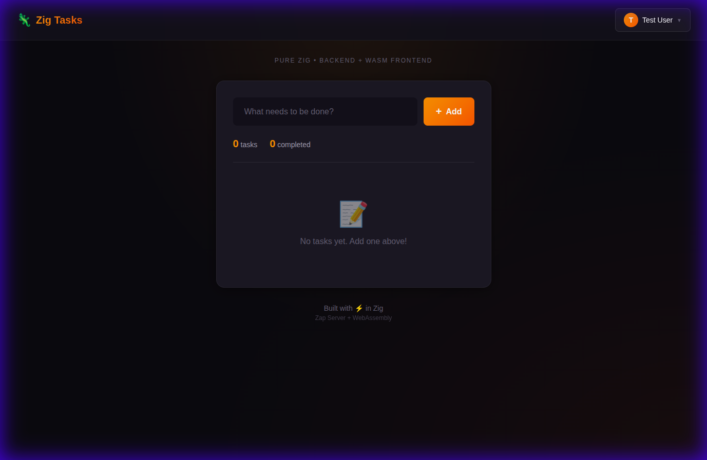
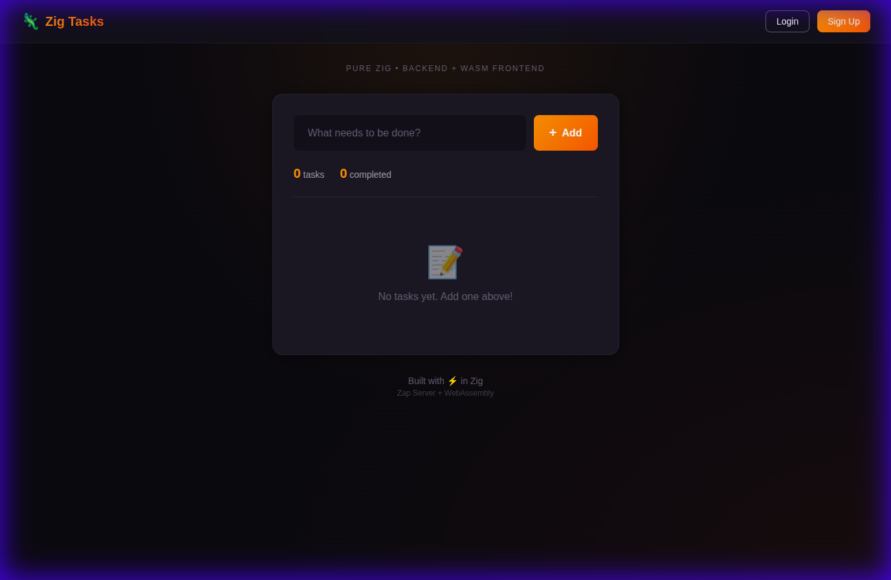

# 🦎 Zig Task Manager

A **full-stack Task Manager** built entirely in Zig — backend, frontend logic, and WebAssembly.



## ✨ Features

- **Pure Zig Backend** — HTTP server with [Zap](https://github.com/zigzap/zap) framework (facil.io)
- **Zig → WebAssembly Frontend** — UI logic compiled to WASM
- **SurrealDB Integration** — Persistent storage for users, tasks, and sessions
- **Secure Authentication** — Signup, login, password reset, email verification
- **Security First** — Argon2id hashing, Rate Limiting, Security Headers, Safe JSON parsing
- **Modern Dark UI** — Glassmorphism, smooth animations, Zig-themed colors

## 📸 Screenshots

| Login Page | Logged In Dashboard |
|------------|---------------------|
|  |  |

## 🚀 Quick Start

### Prerequisites

- [Zig](https://ziglang.org/download/) 0.15.x or later
- [SurrealDB](https://surrealdb.com/) running locally (default port 8000)

### Run

```bash
# Clone and run
git clone <your-repo>
cd zig-task-manager

# Configure environment
cp .env.example .env
# Edit .env with your DB credentials and Email API key

# Build and start server
zig build run

# Open in browser
open http://localhost:9000
```

### Testing

Run the comprehensive smoke test suite to verify all endpoints:

```bash
./scripts/smoke_test.sh
```

## 🏗️ Architecture

```
┌─────────────────────────────────────────────────────────────┐
│                        Browser                               │
│  ┌─────────────┐  ┌─────────────┐  ┌─────────────────────┐  │
│  │ index.html  │  │  style.css  │  │      app.js         │  │
│  │             │  │ (dark theme)│  │ (auth + localStorage)│  │
│  └─────────────┘  └─────────────┘  └─────────────────────┘  │
│                          │                                   │
│                    ┌─────▼─────┐                            │
│                    │ app.wasm  │ ← Zig compiled to WASM     │
│                    └───────────┘                            │
└─────────────────────────────────────────────────────────────┘
                           │ HTTP
                           ▼
┌─────────────────────────────────────────────────────────────┐
│                    Zig + Zap Server                          │
│  ┌──────────────┐  ┌─────────────────────────────────────┐  │
│  │   main.zig   │  │           Handlers                  │  │
│  │ (Routing)    │  │ (auth, tasks, profile, system)      │  │
│  └──────┬───────┘  └──────────────────┬──────────────────┘  │
│         │                             │                     │
│         ▼                             ▼                     │
│  ┌──────────────┐  ┌─────────────────────────────────────┐  │
│  │  util/http   │  │            Domain Models            │  │
│  │ (JSON/Resp)  │  │        (User, Task, Session)        │  │
│  └──────────────┘  └─────────────────────────────────────┘  │
└─────────────────────────┬───────────────────────────────────┘
                          │ HTTP (REST)
                          ▼
┌─────────────────────────────────────────────────────────────┐
│                     SurrealDB                                │
│           (Users, Tasks, Sessions, Tokens)                   │
└─────────────────────────────────────────────────────────────┘
```

## 📁 Project Structure

```
zig-task-manager/
├── src/
│   ├── main.zig          # Server entry point & routing
│   ├── app.zig           # Application state & lifecycle
│   ├── handlers/         # Request handlers
│   │   ├── auth.zig      # Authentication endpoints
│   │   ├── tasks.zig     # Task management
│   │   ├── profile.zig   # User profile
│   │   └── system.zig    # Health & metrics
│   ├── domain/
│   │   └── models.zig    # Data structures
│   ├── db/
│   │   ├── db.zig        # Database interface
│   │   ├── surreal.zig   # SurrealDB implementation
│   │   └── http_client.zig # Optimized HTTP client
│   ├── services/
│   │   ├── auth.zig      # Hashing & tokens
│   │   └── email.zig     # Email sending (Brevo API)
│   └── util/
│       ├── http.zig      # HTTP helpers (JSON, Errors)
│       └── validation.zig # Input validation
├── frontend/             # WASM frontend source
├── public/               # Static assets
├── scripts/              # Helper scripts (smoke tests)
└── build.zig             # Build configuration
```

## 🔐 Security Features

| Feature | Implementation |
|---------|----------------|
| **Password Hashing** | Argon2id (industry standard) |
| **Session Management** | Server-side sessions in SurrealDB |
| **Rate Limiting** | IP-based limiting for Signup/Login |
| **Headers** | `X-Content-Type-Options`, `X-Frame-Options` |
| **Input Validation** | Strict JSON parsing & type checking |

## 🛠️ Development

```bash
# Build only
zig build

# Build and run
zig build run

# Run smoke tests
./scripts/smoke_test.sh
```

## 📦 Dependencies

- **[Zap](https://github.com/zigzap/zap)** — Blazingly fast Zig HTTP server
- **SurrealDB** — Multi-model cloud database

## 📄 License

MIT

---

<div align="center">
  Built with 🧡 in <b>Zig</b>
</div>
