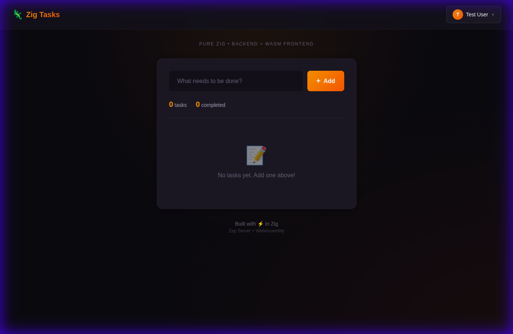
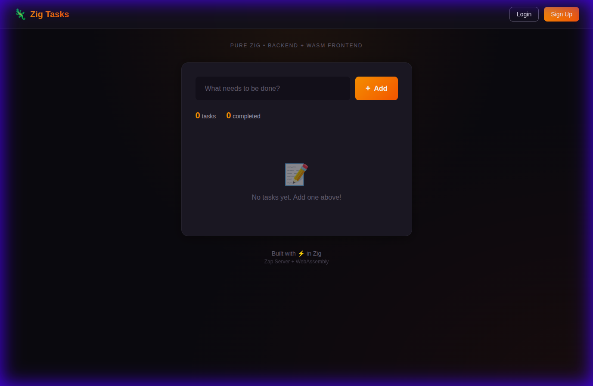

# 🦎 Zig Task Manager

A **full-stack Task Manager** built entirely in Zig — backend, frontend logic, and WebAssembly.



## ✨ Features

- **Pure Zig Backend** — HTTP server with [Zap](https://github.com/zigzap/zap) framework (facil.io)
- **Zig → WebAssembly Frontend** — UI logic compiled to WASM
- **SurrealDB Integration** — Persistent storage for users, tasks, and sessions
- **Secure Authentication** — Signup, login, server-side logout, password reset, email verification
- **Security First** — Argon2id hashing, Rate Limiting, Security Headers, Safe JSON parsing
- **Modern Dark UI** — Glassmorphism, smooth animations, Zig-themed colors

## 📸 Screenshots

| Login Page | Logged In Dashboard |
|------------|---------------------|
|  |  |

## 🚀 Quick Start

### Prerequisites

- [Zig](https://ziglang.org/download/) 0.15.x or later
- [SurrealDB](https://surrealdb.com/) running locally (default port 8000)

### Run

```bash
# Clone and run
git clone <your-repo>
cd zig-task-manager

# Configure environment
cp .env.example .env
# Edit .env with your DB credentials and Email API key

# Build and start server
zig build run

# Open in browser
open http://localhost:9000
```

### Testing

Run the comprehensive smoke test suite to verify all endpoints:

```bash
./scripts/smoke_test.sh
```

## 🏗️ Architecture

```
┌─────────────────────────────────────────────────────────────┐
│                        Browser                               │
│  ┌─────────────┐  ┌─────────────┐  ┌─────────────────────┐  │
│  │ index.html  │  │  style.css  │  │      app.js         │  │
│  │             │  │ (dark theme)│  │ (auth + localStorage)│  │
│  └─────────────┘  └─────────────┘  └─────────────────────┘  │
│                          │                                   │
│                    ┌─────▼─────┐                            │
│                    │ app.wasm  │ ← Zig compiled to WASM     │
│                    └───────────┘                            │
└─────────────────────────────────────────────────────────────┘
                           │ HTTP
                           ▼
┌─────────────────────────────────────────────────────────────┐
│                    Zig + Zap Server                          │
│  ┌──────────────┐  ┌─────────────────────────────────────┐  │
│  │   main.zig   │  │           Handlers                  │  │
│  │ (Routing)    │  │ (auth, tasks, profile, system)      │  │
│  └──────┬───────┘  └──────────────────┬──────────────────┘  │
│         │                             │                     │
│         ▼                             ▼                     │
│  ┌──────────────┐  ┌─────────────────────────────────────┐  │
│  │  util/http   │  │            Domain Models            │  │
│  │ (JSON/Resp)  │  │        (User, Task, Session)        │  │
│  └──────────────┘  └─────────────────────────────────────┘  │
└─────────────────────────┬───────────────────────────────────┘
                          │ HTTP (REST)
                          ▼
┌─────────────────────────────────────────────────────────────┐
│                     SurrealDB                                │
│           (Users, Tasks, Sessions, Tokens)                   │
└─────────────────────────────────────────────────────────────┘
```

## 📁 Project Structure

```
zig-task-manager/
├── src/
│   ├── main.zig          # Server entry point & routing
│   ├── app.zig           # Application state & lifecycle
│   ├── handlers/         # Request handlers
│   │   ├── auth.zig      # Signup, login, logout, verify, reset
│   │   ├── tasks.zig     # Task CRUD
│   │   ├── profile.zig   # User profile & password change
│   │   └── system.zig    # /health, /ready, /metrics
│   ├── config/
│   │   └── config.zig    # .env loader
│   ├── domain/
│   │   └── models.zig    # Data structures
│   ├── db/
│   │   ├── db.zig        # Database interface
│   │   ├── surreal.zig   # SurrealDB implementation
│   │   └── http_client.zig # Optimized HTTP client
│   ├── services/
│   │   ├── auth.zig      # Argon2id hashing & token generation
│   │   └── email.zig     # Email sending (Brevo API)
│   └── util/
│       ├── http.zig      # HTTP helpers (cookies, JSON, errors)
│       ├── json.zig      # JSON helpers
│       ├── log.zig       # Structured logging
│       ├── rate_limiter.zig # Per-IP rate limiting
│       └── validation.zig   # Input validation
├── frontend/src/main.zig # WASM frontend source
├── public/               # Static assets (+ app.wasm after build)
├── scripts/smoke_test.sh # API smoke tests (19 cases)
├── docs/DEPLOY.md        # Deployment guide
├── build.zig             # Build configuration
├── build.zig.zon         # Zig package manifest (Zap dep)
└── .env.example          # Config template
```

## 🔐 Security Features

| Feature | Implementation |
|---------|----------------|
| **Password Hashing** | Argon2id (industry standard) |
| **Session Management** | Server-side sessions in SurrealDB, 7-day expiry, invalidated on logout |
| **Logout** | `POST /api/auth/logout` — deletes the session server-side for both cookie and `Authorization: Bearer` clients |
| **Session Cookie** | `HttpOnly`, `SameSite=Strict`, 7-day max-age |
| **Rate Limiting** | Per-IP limiting for signup (3/min) and login (5/min) |
| **Headers** | `X-Content-Type-Options: nosniff`, `X-Frame-Options: SAMEORIGIN`, `X-XSS-Protection` |
| **Input Validation** | Strict JSON parsing, email/password/name validators |
| **CORS** | Single configured origin (no wildcard in prod) |
| **Secrets** | Loaded from `.env`, never checked into git |

## 🛠️ Development

```bash
# Debug build (fast compile, slow binary ~36MB)
zig build

# Release build for production (~9MB)
zig build -Doptimize=ReleaseFast

# Run directly
zig build run

# Run smoke tests (19 cases)
./scripts/smoke_test.sh
```

## 🚢 Deployment

The reference deployment runs the release binary under systemd with nginx
as TLS-terminating reverse proxy and SurrealDB in Docker on the same host.

`/etc/systemd/system/taskmanager.service`:

```ini
[Unit]
Description=Zig Task Manager
After=network.target docker.service
Requires=docker.service

[Service]
Type=simple
ExecStart=/home/USER/taskmanager/zig-out/bin/taskmanager
WorkingDirectory=/home/USER/taskmanager
Restart=always
RestartSec=5
User=USER
Group=USER

[Install]
WantedBy=multi-user.target
```

Nginx proxies `https://your.domain/` to `127.0.0.1:$PORT` (default 9000)
and forwards `X-Real-IP` so rate limiting sees the real client IP.

See `docs/DEPLOY.md` for the full VPS walkthrough (SurrealDB docker,
Zig install, nginx config, Let's Encrypt).

## 📦 Dependencies

- **[Zap](https://github.com/zigzap/zap)** — Blazingly fast Zig HTTP server
- **SurrealDB** — Multi-model cloud database

## 📄 License

MIT

---

<div align="center">
  Built with 🧡 in <b>Zig</b>
</div>
