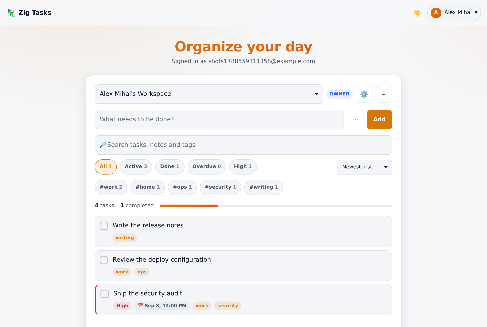
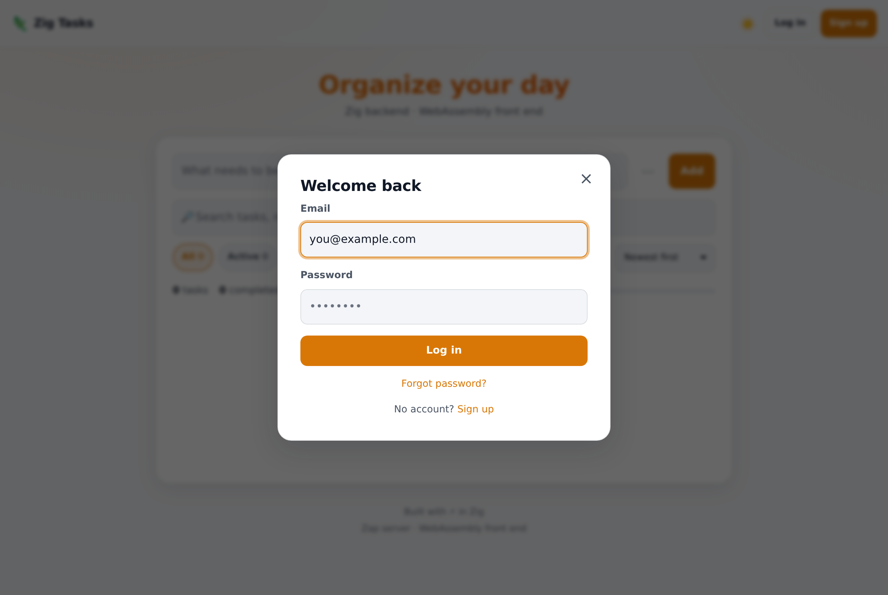
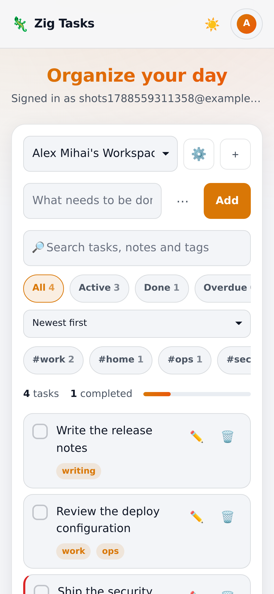

# Zig Task Manager

Production-style task manager built in Zig with a Zap backend, SurrealDB,
WebAssembly frontend, self-hosted SMTP email, hardened authentication, and a
systemd-sandboxed VPS deployment.



## Highlights

- Zig backend with [Zap](https://github.com/zigzap/zap) and facil.io.
- Zig-to-WebAssembly module that owns the anonymous/offline task state, mirrored
  to `localStorage` for persistence across reloads.
- Accessible, responsive UI with light and dark themes: focus-trapped modals,
  keyboard-navigable menus, `aria-live` announcements, and reduced-motion support.
- SurrealDB persistence for users, sessions, verification tokens, reset tokens,
  workspaces, memberships, and tasks.
- Argon2id password hashing and server-side sessions carried by HttpOnly
  cookies.
- Full task editing: title, notes, tags, priority, due date, assignee and
  recurrence, edited inline; plus search across titles/notes/tags, filters
  (active, done, overdue, high priority) and five sort orders.
- A Kanban board alongside the list, with drag-and-drop on pointer devices and
  arrow buttons everywhere else.
- Subtasks, which are ordinary tasks with a parent, so they inherit editing,
  tags, due dates and the workspace permission model.
- Recurring tasks (daily, weekly, monthly); completing one creates the next.
- Selection mode with bulk complete, reopen and delete.
- Keyboard shortcuts, and a CSV export that runs in the browser.
- Multi-workspace task tenancy with owner/admin/member/viewer roles, member
  listing, and email invite acceptance.
- Email verification and password reset through SMTP, dispatched on a background
  queue so response time never reveals whether an address exists.
- Optional email reminders for overdue incomplete tasks.
- Activity log for account and task actions, with a UI to read it.
- Session management: see where you are signed in and revoke a device.
- JSON data export and account deletion, both reachable from the app.
- Per-route rate limiting, strict CORS, CSP, HSTS, safe static-file serving,
  CSRF protection, and protected metrics.
- One-command Docker Compose stack (app + SurrealDB) and 12-factor configuration
  via `.env` or environment variables.
- Production deployment behind nginx/TLS with a hardened systemd service.

## Portfolio Summary

Built and deployed a production-style task manager in Zig with Zap, SurrealDB,
WASM frontend, Argon2id authentication, HttpOnly session cookies, email
verification/password reset via self-hosted SMTP, optional task reminders,
activity logging, workspace/RBAC foundations, CSRF protection, rate limiting,
CSP/HSTS security headers, systemd sandboxing, health/readiness endpoints, and
protected metrics.

More: [docs/PORTFOLIO.md](docs/PORTFOLIO.md)

## Screenshots

| Dashboard | Login | Mobile |
| --- | --- | --- |
|  |  |  |

## Quick Start

### With Docker (recommended)

Brings up the app and SurrealDB together; no local Zig toolchain required:

```bash
docker compose up --build
```

The app is served at `http://localhost:9000`. Configuration is passed via the
`environment:` block in `docker-compose.yml`; set `SMTP_*` there to enable
verification and reset email.

### From source

Requirements:

- Zig 0.15.x
- SurrealDB reachable over HTTP
- SMTP credentials for verification/reset email (optional for local use)

```bash
git clone <repo-url>
cd taskmanager
cp .env.example .env   # optional: config can also come from the environment
zig build run
```

The app defaults to `http://127.0.0.1:9000`. Every `.env` key can be overridden
by a process environment variable of the same name.

## Verification

```bash
./scripts/check.sh            # formatting, build, unit tests
./scripts/integration_test.sh # API against a throwaway SurrealDB
npm install && node scripts/ui_test.mjs   # browser checks
```

All three run in CI on every push.

`integration_test.sh` starts a real SurrealDB in Docker, builds and runs the
application against it, and drives the API through the smoke suite. It is not
redundant with the unit tests: every incompatibility found while moving the
database from SurrealDB 1.x to 3.x — a bound string no longer being a record
id, `DEFINE TABLE` rejecting a table that exists, a renamed time function —
compiles cleanly and passes every unit test. Only talking to a real database
catches them. The script also fails if the schema had to be retried, because a
schema statement the server rejects still leaves a process answering
`/api/health`, so liveness alone would call a broken deploy healthy.

`ui_test.mjs` covers what an HTTP-level suite cannot: that the WebAssembly
module loads and owns the signed-out task list, that a task titled
`<script>alert(1)</script>` renders as text and creates no script element,
that no viewport scrolls sideways, and that the task checkbox — 22px of paint
over a 44px hit area — is still hit when tapped 16px outside its visible box.

## Architecture

```text
Browser
  |
  | HTTPS
  v
Cloudflare / nginx
  |
  | HTTP on 127.0.0.1:9000
  v
Zig + Zap server
  |        \
  |         \ SMTP 587
  |          v
  |       mailcow / SMTP provider
  v
SurrealDB HTTP API
```

More: [docs/ARCHITECTURE.md](docs/ARCHITECTURE.md)

## API

The OpenAPI document is in [docs/openapi.yaml](docs/openapi.yaml).

Main endpoint groups:

- `/api/auth/*`: signup, login, logout, verification, password reset
- `/api/profile*`: profile and password changes
- `/api/workspaces`: workspace listing and creation; members (list, change
  role, remove) and invitations (create, list, revoke, accept)
- `/api/tasks*`: task CRUD with priority, due date, notes, tags, board status,
  recurrence, assignee and parent; `PUT` applies a partial update, or toggles
  completion when the body is empty
- `/api/sessions*`: list and revoke sessions
- `/api/export`: everything the account holds, as one JSON document
- `/api/account`: delete the account, re-authenticating first
- `/api/activity`: authenticated activity log
- `/api/health`, `/api/ready`, `/api/metrics`: operational endpoints

## Security

Security controls are documented in [SECURITY.md](SECURITY.md).

Current controls include:

- Argon2id password hashing
- server-side sessions with HttpOnly cookies and hashed DB tokens
- CSRF tokens bound to the session they were issued with — the token's hash is
  stored on the session row, so forging one requires reading the HttpOnly
  session cookie
- `__Host-` cookie prefixes, which the browser refuses unless the cookie is
  Secure, Path=/ and has no Domain, making it unsettable by sibling subdomains
- workspace membership checks for task reads/writes
- reset-token invalidation and session invalidation after password reset/password change
- authenticated email verification with per-user attempt caps
- background email dispatch so reset/verify response time can't be used to enumerate accounts
- route-specific rate limiting; the per-account login limit counts only failed attempts, and password changes are throttled
- nginx `limit_req` zones in front of the in-process limiters, which survive a restart
- the origin answers only Cloudflare edge addresses, so the WAF cannot be skipped by finding the server's IP
- email addresses normalised to lowercase, so one mailbox cannot hold two accounts
- account deletion requires the password again, not merely a live session
- strict CSP/HSTS/security headers
- SurrealQL variable binding for user input, unit-tested for injection escaping
- path traversal protection for static assets
- SMTP credentials stored only in `.env`; CI secret scanning blocks new leaks
- systemd sandboxing for the deployed process

## Project Structure

```text
src/
  main.zig              routing, CORS, security headers, static serving
  handlers/             auth, profile, task, and system endpoints
  services/             auth and email services
  db/                   SurrealDB repository and HTTP client
  util/                 HTTP helpers, validation, rate limiting, logging
frontend/src/main.zig   WASM module backing anonymous tasks
public/                 HTML, CSS, JS, SVG favicon, generated WASM
scripts/check.sh        local verification entry point
scripts/smoke_test.sh   optional API smoke tests
docs/                   deployment, architecture, roadmap, OpenAPI, portfolio
Dockerfile              multi-stage build (Zig builder + slim runtime)
docker-compose.yml      app + SurrealDB stack
```

## Roadmap

The current roadmap focuses on making the app more useful while keeping the
engineering work visible:

- isolated integration test database
- ongoing secret-scanning review
- workspace member management UI
- task labels
- recurring tasks
- activity export

More: [docs/ROADMAP.md](docs/ROADMAP.md)

## Deployment

The reference deployment runs the release binary under systemd with nginx as
TLS-terminating reverse proxy, SurrealDB on localhost, and SMTP via mailcow.

More: [docs/DEPLOY.md](docs/DEPLOY.md)

## License

MIT
